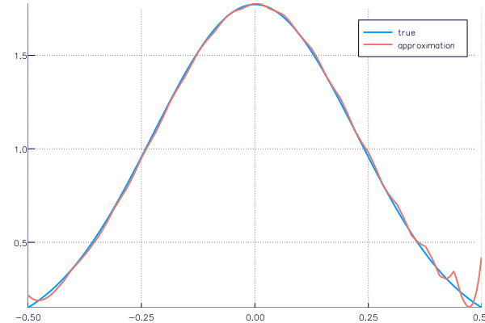
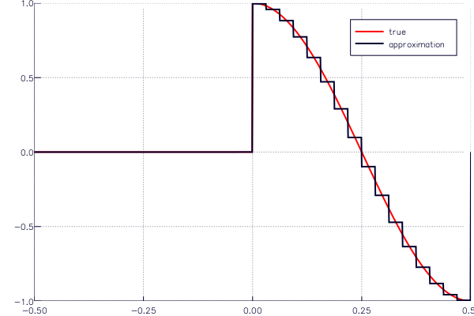

.. _starting:

Getting Started
===============

Installation
------------

The *GeneralizedSampling* package is available through the Julia package system by running ``Pkg.add("GeneralizedSampling")``.

Background
----------

When sampling a function/signal, one often has to use a basis that is inferior for reconstruction, i.e., a basis requires a large number of elements to give a decent approximation.
Think e.g. of the `Gibbs phenomenon <https://en.wikipedia.org/wiki/Gibbs_phenomenon>`_ that occurs when using the Fourier basis for reconstructing discontinuous functions.

Generalized sampling is a general technique for transforming samples of a function w.r.t. one basis into samples w.r.t. another basis, i.e., essentially performing a change of basis.

The *GeneralizedSampling* package currently implements transformations from the Fourier to the scaling function basis on :math:`L^2([-1/2,1/2]^d)`.

Basic Usage
-----------

The primary element in *GeneralizedSampling* is a change of basis type (`CoB`) computed from the sample **locations**, the name of wavelet used for reconstruction and the scale `J` of the wavelet space:

.. code-block:: julia

    T = freq2wave(samples, wavename, J)

The :code:`T` object behaves in many ways like the ordinary matrix it resemples.
In particular, multiplication, multiplication with its adjoint and the backslash operator for least squares solutions work as expected.
So if the Fourier transform :code:`Ghat` of a function :code:`G` is sampled in the locations used for :code:`T`, :code:`G`'s representation :code:`w` in the wavelet domain of scale `J` is approximated by

.. code-block:: julia

    f = Ghat(samples)
    w = T \ f

To evaluate ``w`` in the wavelet basis, the `IntervalWavelets package <https://github.com/robertdj/IntervalWavelets.jl>`_ can be used:

.. code-block:: julia

    using IntervalWavelets
    y = weval(w, wavename, R)

The third argument ``R`` controls the number of points in which each scaling function is evaluated -- se the documentation for :code:`IntervalWavelets` for examples.

A simple example is the Gaussian density, since its Fourier transform is again a Gaussian density.
Consider an approximation with :math:`2^5 = 32` Daubechies 4 scaling functions from 64 Fourier measurements:

.. code-block:: julia

    using GeneralizedSampling
    xi = GeneralizedSampling.grid(64, 0.5);
    T = Freq2Wave(xi, "db4", 5)
    f = exp(-xi.^2);
    w = T \ f;
    using IntervalWavelets
    x, y = weval(real(w), "db4", 10);

Using the `Plots package <https://github.com/tbreloff/Plots.jl>`_ this can be plotted with the following commands:

.. code-block:: julia

    using Plots
    plot(x, sqrt(pi)*exp(-(pi*x).^2), label="true")
    plot!(x, y, label="approximation")

The undesired behavior in the ends can be resolved by increasing the number of Fourier measurements or using a different wavelet for reconstruction.

Complete examples are found in the `examples` folder.
The file :code:`truncated_cosine.jl` approximates a truncated cosine in the Haar basis and can be called using

.. code-block:: julia

    tc_path = joinpath(Pkg.dir("GeneralizedSampling"), "examples", "truncated_cosine.jl")
    include(tc_path)

**Note**: 

- The theory of generalized sampling promises that the change of basis matrix :math:`T` is numerically stable under a number of assumptions:
    * The number of samples must be sufficiently high compared to :math:`J`.
    * The samples must be in a domain symmetric around the origin.
    * For samples on a grid the distance to neighboring sample points must be less than the inverse length of the reconstruction interval.
    * Non-uniform samples must have a sufficiently high bandwidth and sufficiently low density -- see :cite:`Adcock:Gataric:Hansen:2014` and :cite:`Adcock:Gataric:Hansen:2015` for further details.
- The condition number of :math:`T` is not directly available. To compute the condition number the change of basis matrix has to be computed explicitly with ``collect(T)``.
- The change of basis matrix may very well be too large to compute explicitly; check ``size(T)`` before collecting.

